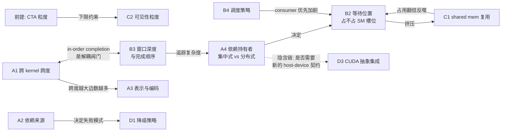

# CTA 级 PDL 设计空间调研报告

> **定位**：如果要在 B300 之上做 **CTA（thread block）粒度的 kernel 间依赖管理**，设计空间长什么样
> 本文只做**中立梳理**——枚举维度、枚举选项、列出各自的 trade-off，**不给推荐结论**，留作后续设计讨论的底稿。
>
> 姊妹文档分工：
>
> - [`cuda_13.4_pdl_clc_interfaces.md`](./cuda_13.4_pdl_clc_interfaces.md) —— 现有 PDL/CLC 接口是什么、硬件如何反推（**现状**）
> - 本文 —— 若要做 CTA 级，有哪些设计选项（**设计空间**）
> - [`../archive/prologue_inspector_cta_pdl.md`](../archive/prologue_inspector_cta_pdl.md) —— 该空间中的**一个**已探索坐标（已归档，不是本文的推荐项）
> - [`../docs/cta_pdl_eval_plan.md`](./cta_pdl_eval_plan.md) —— 如何在 B300 真机上评估这些选项
> - [`../papers/README.md`](../papers/README.md) —— 43 篇参考文献按维度索引

---

## 0. 阅读指

### 0.1 前提：粒度固定为 CTA，不作为可选项枚举

全文把依赖粒度**固定在 CTA 级**作为前提，而非展开成一个设计维度：

- **grid→grid** 是现状基线（今天的 `griddepcontrol.wait`），全文作为对照组出现，不是候选项
- **warp / 更细粒度**不纳入。CTA 是 GPU 的调度与资源分配单位（寄存器、shared memory、warp slot 都按 CTA 分配），比 CTA 更细的粒度没有对应的调度对象可挂靠
- **cluster→cluster** 作为 CTA 粒度的一个**变体**在 A1 中提及。CLC（`clusterlaunchcontrol`，sm_100+）以 cluster 为调度单位，可视为"粗化的 CTA"

在此前提下，A1 讨论的不是"粒度选多细"，而是**CTA 级依赖要跨几个 kernel 来表达**。

### 0.2 双重标注体系

每个选项带两个标记，缺一不可：

**实现层级**——把它做出来需要什么：

| 标记     | 含义                                                                           |
| -------- | ------------------------------------------------------------------------------ |
| `[S]`  | 现有 sm_90/sm_100 硬件 + 纯软件即可实现，**可在 H100 / B300 上直接实测** |
| `[H-]` | 需小幅硬件/ISA 扩展（如`griddepcontrol.wait.range` 这类对现有指令的泛化）    |
| `[H+]` | 需大改前端调度器或内存子系统                                                   |

**B300 状态**——现在有没有：

| 标记            | 含义                                                       |
| --------------- | ---------------------------------------------------------- |
| `[B300:有]`   | 该提案已被产品化，机制不再新颖，参考价值只剩动机与量化数据 |
| `[B300:部分]` | 方向被采纳，但粒度或形式不同，缝隙处仍有空间               |
| `[B300:无]`   | 未实现，机制本身仍值得借鉴                                 |

**为什么需要第二个标记**：本项目是在 B300 之上做进一步设计，而参考文献跨度从 2007 到 2021。一篇论文的提案是否已经变成硬件特性，直接决定它是"可借鉴的机制"还是"只能引用其动机的历史"。§1 是这个过滤器的集中呈现。

### 0.3 维度总览（5 组 14 维）

| 组                       | 维度                        | 一句话                                    |
| ------------------------ | --------------------------- | ----------------------------------------- |
| **A 依赖的描述**   | A1 跨 kernel 跨度           | CTA 级依赖要跨几代 kernel 表达            |
|                          | A2 依赖信息来源             | 依赖从哪来（标注/编译期/JIT/运行时/硬件） |
|                          | A3 表示与编码               | 依赖图怎么存（CSR/模板/区间/掩码/计数）   |
|                          | A4 持有者与方向             | 谁持有依赖（集中 vs 分布）、pull vs push  |
| **B 依赖的执行**   | B1 同步协议                 | 就绪信号怎么产生、怎么等、怎么唤醒        |
|                          | B2 等待位置与 occupancy     | 等待时 CTA 占不占 SM 槽位                 |
|                          | B3 乱序窗口与完成顺序       | 几个 kernel 同时在飞、是否强制按序完成    |
|                          | B4 调度策略与资源分区       | 谁先调度、SM 资源怎么分                   |
| **C 数据与局部性** | C1 shared memory 与数据复用 | 前后 kernel 的 CTA 能否复用 on-chip 数据  |
|                          | C2 内存可见性与一致性       | 可见性粒度、fence scope、与调度许可的解耦 |
| **D 工程属性**     | D1 降级策略                 | 依赖推不出来时怎么退                      |
|                          | D2 正确性与调试             | 失败模式与验证手段                        |
|                          | D3 与 CUDA 抽象的集成       | stream / event / Graph / CLC 怎么接       |
| **E 横切**         | E1 收益边界判据             | 什么参数区间下才有收益                    |

---

## 1. 横切视角：B300 (sm_103) 已实现 vs 未实现

**这是全文最重要的过滤器。** 参考文献里的提案，有相当一部分在 2016–2024 年间被 NVIDIA 产品化了。下面把 43 篇文献的提案逐条过一遍。

### 1.1 已产品化 `[B300:有]`

| 论文提案                                                                                                                                        | B300 对应特性                                                                   | 引入代次         | 剩余差距                                                         |
| ----------------------------------------------------------------------------------------------------------------------------------------------- | ------------------------------------------------------------------------------- | ---------------- | ---------------------------------------------------------------- |
| **kernel 预启动以隐藏 launch 开销**BlockMaestro 贡献 #1、Kim PACT'16 核心动机                                                             | **PDL / `griddepcontrol`**                                              | Hopper sm_90     | **仅 grid 级**；CTA 级仍空缺                               |
| **persistent kernel + 工作队列 + work stealing**Whippletree、Softshell、Juggler、Persistent Threads、Pagoda、硬件 worklist (Kim MICRO'14) | **CLC `clusterlaunchcontrol.try_cancel`**（硬件单一赢家仲裁的动态取工） | Blackwell sm_100 | 只能领取**已排队**的 cluster，不能动态**生成**新工作 |
| **跨 CTA 快速 barrier / peer-SM 同步**Xiao IPDPS'10、StreamScan PPoPP'13、PeerWave                                                        | Cooperative Groups`grid.sync()barrier.cluster.arrive/wait`                    | Hopper           | cluster 内限定，跨 grid 不可用                                   |
| **硬件异步屏障与细粒度同步**SSB (Zhu ISCA'07)、Stuart、Fine-Grained Sync (Li ICS'15)                                                      | **mbarrier + transaction counting**                                       | Hopper           | mbarrier 是**屏障**，不是逐字的 full/empty                 |
| **warp specialization 生产者-消费者**Singe PPoPP'14                                                                                       | TMA + warp specialization                                                       | Hopper           | 已成标准范式                                                     |
| **kernel 级任务图**Wireframe/ATMI 的 "tasks as kernels" 层、StarPU、XKaapi、Legion、PTask、GeMTC                                          | **CUDA Graphs**                                                           | CUDA 10          | 静态图；动态任务图仍需运行时                                     |
| **多硬件队列消除跨 stream 伪依赖**context funneling (Wang HPCS'11)、Guevara'09                                                            | **Hyper-Q**（32 connections）                                             | Kepler           | 默认仅 8 条，需调`CUDA_DEVICE_MAX_CONNECTIONS`                 |
| **空间多任务 SM 分区**Adriaens HPCA'12、Li ICPP'11、Ravi HPDC'11                                                                          | **MIG / MPS**                                                             | Ampere / Kepler  | 静态分区，非动态解析模型                                         |
| **GPU 抢占**Tanasic ISCA'14、PKM ECRTS'12、FLEP ASPLOS'17、EffiSha PPoPP'17                                                               | 指令级 compute preemption                                                       | Pascal           | 驱动控制，无编程接口                                             |
| **scoped 同步**HRF (Hower ASPLOS'14)                                                                                                      | PTX`.cta`/`.gpu`/`.sys` scope                                             | —               | 见 §1.4 反向注记                                                |

### 1.2 部分实现 `[B300:部分]`

- **跨 CTA 的 on-chip 数据直传** — Stash (Komuravelli ISCA'15) 提出全局可寻址且保持一致性的类 scratchpad → Hopper 的 **DSMEM / cluster 内分布式 shared memory** 是它的受限版本。**但只能在同一 grid 内的 cluster 里用，跨 kernel 不可用**。C1 维度的空白正落在这道缝里——机制存在，但被 grid 边界挡住了
- **L2 驻留控制** — cache bypassing 整条线（Li SC'15、Xie HPCA'15、Chen MICRO'14）→ `cudaAccessPolicyWindow` / L2 persistence / `.L2::eviction_priority`（Ampere）。是**地址范围提示**，不是调度决策；调度器仍不感知局部性
- **设备侧启动** — CDP → CDP2（Hopper）降低了开销、去掉父子同步限制，但仍是 **kernel 粒度**；DTBL (ISCA'15) 的 TB 粒度 spawn 未实现

### 1.3 未实现 `[B300:无]`（本报告的重点）

- **CTA / tile 级依赖表达与解析** — `griddepcontrol` 仍是 grid 级 all-or-nothing。PTX 9.4（CUDA 13.4 preview）对这三条指令**零改动**（见姊妹文档附录 A/C）。BlockMaestro 贡献 #2/#3、Wireframe 的 DATS、Kim PACT'16 的 CRCS **全部仍未实现**
- **局部性 / 复用感知的 TB 调度** — TB 调度器仍是黑盒、不可编程、不感知局部性。IKRA、PAVER、OWL、Locality Descriptor、CTA Clustering、Lee HPCA'14 全部未实现
- **intra-SM 跨 kernel 的受控资源分区** — 并发 kernel 可共享 SM，但没有 Warped-Slicer / SMK 那种解析模型驱动的分区；Elastic Kernels、Equalizer、Zorua 的资源弹性也未实现
- **SM-centric 任务放置** — 无法把 CTA 钉到指定 SM；SM-centric transformation 仍要靠读 `%smid` + retreat 的软件 hack
- **跨 kernel 的 shared memory 所有权转移** — 完全空白
- **硬件竞争检测** — HAccRG (ICPP'13)、ScoRD (ISCA'20) 未实现
- **full/empty bit / 同步状态缓冲** — 未实现。Lustig HPCA'13 的 CPU-GPU full/empty 同步、Zhu ISCA'07 的 SSB 仍是仅有的参考

### 1.4 没走的路（NVIDIA 选了相反方向，作为设计空间的另一支保留）

两条值得单独标出，因为它们不是"还没做"，而是**被明确否定过的方向**：

- **Chimera 的 SM-flushing** — 利用 TB 的幂等性直接**丢弃**并重执行，而非保存上下文。NVIDIA 走的是完整 context save/restore。这个机制在"消费者 CTA 等待时被抢占"的场景下仍有参考价值（对应 B2）
- **DeNovo / hLRC 主张取消 scoped 同步** — 论证 HRF 的复杂度"既不必要也不充分"。NVIDIA 采纳了 HRF 路线（`.cta`/`.gpu`/`.sys`）。CTA 级依赖若要做细粒度可见性，这两篇提供了"不用 scope 也能高效"的另一种论证（对应 C2）

### 1.5 这个过滤器怎么用

读后续各维度时，`[B300:有]` 的选项意味着：**该选项已是现状的一部分，作为 Floor 基线出现**，不是可以"选"的设计点。`[B300:无]` 的选项才是真正的设计空间。`[B300:部分]` 的缝隙处往往是最有价值的位置——机制已存在、只差一层限制。

---

## 2. A 组：依赖的描述

这一组回答"依赖关系**是什么、从哪来、怎么存、谁拿着**"，不涉及执行。

### A1 CTA 级依赖的跨 kernel 跨度

前提已把粒度固定在 CTA，本维度问的是：**CTA 级依赖要跨几个 kernel 来表达**。拆成四个子维度。

#### A1.1 跨度深度

| 选项                            | 含义                                                                            | 存储代价                      | 标注                   |
| ------------------------------- | ------------------------------------------------------------------------------- | ----------------------------- | ---------------------- |
| **span = 1（仅相邻对）**  | 只表达`K_i → K_{i+1}` 的 CTA 二分图；跨代依赖靠 in-order completion 隐式满足 | 每对一张图                    | `[S]` `[B300:无]`  |
| **span = k（固定 k 代）** | 允许显式`K_i → K_{i+2}` 等跨代边                                             | ×k                           | `[S]` `[B300:无]`  |
| **span = ∞（任意 DAG）** | 全应用的 CTA 级依赖图                                                           | 可达数百 MB（Wireframe 自述） | `[H-]` `[B300:无]` |

BlockMaestro 选 span=1，靠**强制 in-order completion** 把跨代依赖变成隐式满足——K3 即使先跑完也不标记完成，直到 K2 完成。这样任何跨越多代的依赖都被前一代的完成所蕴含，依赖追踪被限制在相邻 kernel 对之间。这个技巧的代价见 §7 耦合链 3。

Wireframe 与 Juggler 支持任意 DAG，但都是**单 kernel 内**的任务图（Wireframe 把多 kernel 负载压成一个 mega-kernel），不是跨 kernel 的 CTA 依赖。

> **空白**：跨多个 kernel 的非线性 DAG + CTA 粒度，没有找到对口工作。

#### A1.2 依赖拓扑形态

| 选项                                     | 典型负载               | 标注                  |
| ---------------------------------------- | ---------------------- | --------------------- |
| **线性链** `K1→K2→K3`          | 迭代求解、LLM 逐层前向 | `[S]` `[B300:无]` |
| **非线性 DAG** `K1→{K2,K3}→K4` | 多分支融合、diamond    | `[S]` `[B300:无]` |

#### A1.3 跨 kernel 的 CTA ID 空间与 kernel 标识

相邻 kernel 的 `gridDim` 通常不同，CTA ID 空间不同，因此依赖本质上是**跨空间的映射**。需要一个 kernel 标识把两个空间区分开。

| 选项                        | 做法                                                                  | 可区分 kernel 数 | 标注                   |
| --------------------------- | --------------------------------------------------------------------- | ---------------- | ---------------------- |
| **附加到 TB ID 高位** | BlockMaestro：TB ID 上追加 2 bit，即 kernel ID 的低 2 位，wrap-around | 4                | `[H-]` `[B300:无]` |
| **单独字段**          | 依赖记录里独立存 kernel ID                                            | 由位宽决定       | `[H-]` `[B300:无]` |
| **隐式靠相邻关系**    | 只支持 span=1 时可省略标识                                            | 2                | `[S]` `[B300:无]`  |

标识位宽与 B3 的窗口深度直接绑定：能同时在飞几个 kernel，就至少需要几位标识。

#### A1.4 同一 kernel 反复调用时依赖图能否复用

这一条决定了**依赖分析成本能否摊销**，对 kernel 数量极多的负载是生死线。

| 情形                       | 依赖图               | 分析成本       | 例子                                                |
| -------------------------- | -------------------- | -------------- | --------------------------------------------------- |
| **gridDim 每轮不变** | 完全相同，可缓存复用 | 摊销到近零     | stencil 迭代、LLM 逐层（同 shape）、SpMV 迭代       |
| **gridDim 每轮变化** | 每轮不同，必须重算   | 正比于调用次数 | GAUSSIAN 消元（逐轮缩小）、NW wavefront（先增后减） |

BlockMaestro 的评估里 GAUSSIAN 有 510 次 kernel 调用、NW 有 255 次、GRAMSCHM 有 192 次，**且 gridDim 逐轮变化**。论文用"分析开销被 kernel 预启动掩盖"一句带过，但 Algorithm 1 第 19–21 行是**逐线程枚举地址**（`for all t ∈ Threads`），对几十万线程的 kernel 重复数百次，这个开销未被量化。

缓存键应为 `(context/module 实例, 函数, gridDim, blockDim, 各指针实参值)`——注意 context 维度是必要的，因为 `__device__` 变量的符号地址是 per-instance 的，跨 context 复用会拿到错误地址范围。

---

### A2 依赖信息来源

| 选项                                | 代表工作                                   | 能处理的访存                      | 程序员负担             | 标注                              |
| ----------------------------------- | ------------------------------------------ | --------------------------------- | ---------------------- | --------------------------------- |
| **程序员显式标注**            | Wireframe DepLinks、ATMI、PDL trigger 位置 | 任意                              | O(任务数) 或 O(数组数) | `[S]` `[B300:有]`（PDL 层面） |
| **编译期静态分析**            | —                                         | 仿射，且需 gridDim 已知才能实例化 | 零                     | `[S]` `[B300:无]`             |
| **JIT / launch 期静态分析**   | BlockMaestro（PTX 值域分析）               | 仿射                              | 零                     | `[H-]` `[B300:无]`            |
| **运行时探测**                | inspector kernel、prologue inspector       | 间接（需结构数组先于生产者就绪）  | 零                     | `[S]` `[B300:无]`             |
| **硬件推断**                  | Kim PACT'16 CRCS 引用计数、地址监控        | 任意（粗粒度）                    | 零                     | `[H+]` `[B300:无]`            |
| **混合：写侧静态 + 读侧动态** | —                                         | gather 类                         | 零～低                 | `[S]` `[B300:无]`             |

**静态分析的判据**：一条 global load/store 的地址计算链，能否一路回溯到 **device 变量地址 / 立即数 / kernel 参数**这三类源头而不经过任何一次访存。BlockMaestro Algorithm 1 第 7–9 行一旦回溯撞上 global load 就 END，保守判定为整 kernel 全连接依赖。注意第 7 行特意限定为 "global load"——kernel 参数虽然也经 `ld.param` 读取，但 param space 的值在 launch 时已固定，不触发回退。

**PAVER 的技术手段与 BlockMaestro 高度重合**（同为 UCR 组）：同样是 JIT 期从 PTX 提取 TB 的 load 地址范围，只是用于 **locality** 而非 dependency。这意味着同一套分析基础设施可同时服务 A2 与 C1 两个维度。

**一个具体的算法改进点**（来自 DSA 分析，见 [`cta_pdl_eval_plan.md`](./cta_pdl_eval_plan.md) Tier 5）：BlockMaestro 的判据是"地址是否来源于 global load"，但更准确的判据应是**该数据是否由本步的前驱 kernel 产生**。DSA 的 `sparse_attn` 读 `KV[idx[i]]` 属于间接访存，但被读的 KV 是**更早的 decode step 写入的**，与紧邻前驱无 RAW 关系；真正的依赖只有对 `idx` 的那条，且按 query 块是 1-to-1。**按数据的产生时间而非仅按地址来源判定**，可以把这类场景从"保守全连接"救回"规整 1-to-1"。

---

### A3 依赖表示与编码

| 选项                             | 代表                         | 存储量级（N 个父 CTA、M 个子 CTA） | 解码成本       | 标注                                                    |
| -------------------------------- | ---------------------------- | ---------------------------------- | -------------- | ------------------------------------------------------- |
| **完整邻接表 / CSR**       | Wireframe                    | O(边数)，最坏 O(MN)                | 需访存遍历     | `[S]` `[B300:无]`                                   |
| **参数化模式模板**         | BlockMaestro Table I 的 7 种 | 见下表                             | 闭式计算，O(1) | `[S]` `[B300:无]`                                   |
| **区间二元组 `[lo,hi]`** | —                           | O(1) / 子 CTA                      | 两次比较       | `[S]` `[B300:无]`                                   |
| **位掩码**                 | —                           | O(N/64) 字 / 子 CTA                | 位运算         | `[S]` `[B300:无]`                                   |
| **引用计数记分牌**         | Kim PACT'16 CRCS             | O(M)                               | 递减+比较      | `[H-]` `[B300:无]`                                  |
| **单 bit（全连接）**       | BlockMaestro 的回退          | O(1)                               | 无             | `[S]` `[B300:有]`（等价于 `griddepcontrol.wait`） |

**BlockMaestro 的 7 种模式与存储开销**：

| 模式               | 开销                   |
| ------------------ | ---------------------- |
| 全连接             | O(1)（不编码则 O(MN)） |
| n-组全连接         | O(M+N)                 |
| 1-to-1（M=N）      | O(N)                   |
| 1-to-n             | O(M+N)                 |
| n-to-1             | O(N)                   |
| 重叠（overlapped） | O(N + M·deg_max)      |
| 独立               | O(1)                   |

论文实测：经模式编码后平均存储减少 **34.7%**（AlexNet 压到 0.012、GAUSSIAN 压到 1.77e-4；FDTD-2D、FFT、HS、NW、PATH 无法压缩）。

> **一个未被论文自己利用的洞察**：Table I 已经表明实际依赖图**几乎总是参数化的规则模式**而非任意图。既然如此，分析算法本身就不该用"逐线程枚举地址 + 集合求交"的暴力做法，而应当"编译期识别模式模板、运行时实例化参数"。BlockMaestro 在表示层用了这个洞察，却没有反过来用到分析层。

**存储量级的实际含义**：区间表示对"依赖度高但结构规整"的场景是决定性的。LLM 的 FFN GEMM 链中，GEMM 输出 tile 依赖上游 token 行区间 `[m·BM, (m+1)·BM)`，依赖度 ≈ BM（128 或 256），但区间表示只需两个整数。DSA 的 indexer→topk 依赖度可达数千，同样是连续区间。**因此"依赖度"与"结构复杂度"必须分开评估**，见 E1。

---

### A4 依赖的持有者与方向

两个正交的子选择。

#### A4.1 集中式 vs 分布式

| 选项                     | 谁持有                  | 存储位置                    | 代表                                          | 标注                                        |
| ------------------------ | ----------------------- | --------------------------- | --------------------------------------------- | ------------------------------------------- |
| **集中式**         | 调度器持有全局依赖图    | 调度器 SRAM + global memory | BlockMaestro（22KB buffer）、Wireframe（CSR） | `[H+]` `[B300:无]`                      |
| **分布式 per-SM**  | 每 SM 一个任务队列      | global memory               | Juggler                                       | `[S]` `[B300:部分]`（CLC 提供硬件取工） |
| **分布式 per-CTA** | 每个 CTA 只持有自己那份 | **CTA 寄存器**        | —                                            | `[S]` `[B300:无]`                       |

per-CTA 自持有是一个空白坐标（`prologue_inspector` 设计位于此）。它的特点是**完全不需要物化全局依赖图**——没有 O(M·deg) 存储、没有硬件 buffer、没有写图读图的访存流量，代价是每个 CTA 要花 prologue 时间自己算。

#### A4.2 pull vs push

| 选项                         | 语义                                   | 需要的映射                               | 标注                   |
| ---------------------------- | -------------------------------------- | ---------------------------------------- | ---------------------- |
| **消费者持有（pull）** | "我依赖谁"，消费者轮询生产者的完成状态 | 地址 → 生产者 CTA                       | `[S]` `[B300:无]`  |
| **生产者持有（push）** | "我完成后唤醒谁"，生产者主动通知       | 地址 → 消费者 CTA（**反向映射**） | `[H-]` `[B300:无]` |

pull 的映射（地址→生产者 CTA）通常可静态推导，因为生产者的写集合几乎总是仿射的。push 的反向映射（地址→消费者 CTA）在 gather 类负载中静态不可得，需要消费者先登记。因此 **push 通常需要一个额外的登记步骤**，换来的是精确唤醒、零轮询。

#### A4.3 与 B2 的绑定（预告）

A4.1 的选择**直接决定** B2 的可选范围：分布式 per-CTA 意味着 CTA 必须已驻留才能算出自己的依赖，因此只能占着 SM 槽位等待；只有集中式才能在派发前门控。详见 §7 耦合链 1。

---

## 3. B 组：依赖的执行

这一组回答"依赖关系**怎么被执行**"：就绪信号怎么产生、在哪等、等多久、谁先跑。

### B1 同步协议

三个正交的子选择，可自由组合。

#### B1.1 就绪信号的产生

| 选项                             | 做法                                                             | 开销                     | 标注                                            |
| -------------------------------- | ---------------------------------------------------------------- | ------------------------ | ----------------------------------------------- |
| **CTA 退出时硬件自动置位** | 调度器在 CTA retire 时更新位图                                   | 零软件开销               | `[H-]` `[B300:无]`                          |
| **显式指令**               | CTA 主动发信号（类似 CTA 粒度的`launch_dependents`）           | 一条指令                 | `[H-]` `[B300:无]`                          |
| **软件原子写位图**         | `cuda::atomic_ref<int, thread_scope_device>.store(1, release)` | 一次 release store / CTA | `[S]` `[B300:无]`                           |
| **引用计数递减**           | 生产者完成时递减子 CTA 的 parent counter                         | 一次原子递减 / 依赖边    | `[S]`（软件）/ `[H-]`（硬件） `[B300:无]` |
| **单调完成计数器**         | 若完成顺序近似单调，用一个计数器代替位图                         | 一次原子递增             | `[S]` `[B300:无]`                           |

单调完成计数器是个实用的简化：若生产者 CTA 的完成顺序在 GTO 调度下接近单调，则"等待区间 `[lo,hi]`"可退化为"等待计数器 ≥ hi"，一次比较覆盖整个区间，省掉逐位轮询。**单调性有多强需要实测**（见评估方案 Tier 0）。

#### B1.2 等待的实现

| 选项                           | 做法                                              | 关键代价                                                                   | 标注                                |
| ------------------------------ | ------------------------------------------------- | -------------------------------------------------------------------------- | ----------------------------------- |
| **软件自旋（固定间隔）** | 轮询 global memory 标志                           | 持续消耗 L2 带宽                                                           | `[S]` `[B300:无]`               |
| **软件自旋 + 指数退避**  | `__nanosleep(backoff)`，backoff 翻倍            | 大幅降低轮询流量，代价是唤醒延迟                                           | `[S]` `[B300:无]`               |
| **复用 mbarrier**        | 硬件异步屏障                                      | mbarrier 在 shared memory，**跨 kernel 不可用**；仅 cluster 内可参考 | `[S]` `[B300:有]`（cluster 内） |
| **硬件阻塞指令**         | `griddepcontrol.wait` 的 CTA 级泛化             | 需 ISA 扩展                                                                | `[H-]` `[B300:无]`              |
| **调度器门控**           | 未就绪的 CTA 根本不派发                           | 需集中式依赖表                                                             | `[H+]` `[B300:无]`              |
| **现状对照**             | `griddepcontrol.wait`（整 grid all-or-nothing） | —                                                                         | `[S]` `[B300:有]`               |

#### B1.3 唤醒方式

| 选项                                                       | 标注                   |
| ---------------------------------------------------------- | ---------------------- |
| **轮询**（消费者反复查）                             | `[S]` `[B300:无]`  |
| **事件驱动精确唤醒**（硬件在依赖满足时唤醒特定 CTA） | `[H-]` `[B300:无]` |
| **广播**（生产者完成时通知所有等待者）               | `[H-]` `[B300:无]` |

精确唤醒的价值有两层：消除轮询对 L2 带宽的消耗；让等待中的 warp 真正挂起而非占用发射槽。但寄存器与 shared memory 仍被占用（见 B2）。

---

### B2 等待位置与 occupancy

**单列此维度的原因**：它是全文最强的耦合点。

| 选项                      | 等待时 CTA 状态          | occupancy 代价                              | 依赖必须由谁算     | 标注                                                                     |
| ------------------------- | ------------------------ | ------------------------------------------- | ------------------ | ------------------------------------------------------------------------ |
| **派发前门控**      | 未上机器                 | 无                                          | 调度器（集中式）   | `[H+]` `[B300:无]`                                                   |
| **驻留后等待**      | 已占用 SM 槽位           | 寄存器 + shared memory + warp slot 全部占用 | CTA 自己或读全局表 | `[S]` `[B300:有]`（PDL 即此模式）                                    |
| **warp 级部分等待** | 部分 warp 等待，其余继续 | 部分                                        | CTA 自己           | `[S]` `[B300:部分]`（EDGE 的 warp 抢占提供了第三种可能，但未产品化） |

**核心取舍**：BlockMaestro 让未就绪的 TB 根本不上机器，因此零 occupancy 损失；但代价是依赖必须以调度器可消费的形式集中表达，从而**排除了所有运行时才能确定的依赖**。PDL 走的是相反路线——CTA 先上机器再等，因此依赖可以由 CTA 自己在 prologue 里算，但要付 occupancy 代价。

**occupancy 代价的大小取决于消费者 kernel 的资源占用**：shared memory 用量越大、寄存器越多，等待中的 CTA 挤占的资源越多。这条曲线需要实测（评估方案 Tier 0 第 3 项），它是给"派发前门控"这个 `[H+]` 选项定价的唯一依据——即"如果等待不占槽位能省多少"。

---

### B3 乱序窗口与完成顺序

> **与 A1 的边界**：A1 是"依赖关系要**表达**几代"（描述问题），B3 是"同时允许几个 kernel **在飞** + 完成顺序约束"（执行问题）。二者**可以不相等**——BlockMaestro 就是窗口深度 4、但依赖表达跨度只有 1，中间靠 in-order completion 这个阀门解耦。详见 §7 耦合链 3。

#### B3.1 窗口深度

| 选项                                   | 代表                                   | 标注                                        |
| -------------------------------------- | -------------------------------------- | ------------------------------------------- |
| **1**（一个 stream 一个 kernel） | 传统 CUDA 语义                         | —`[B300:有]`                             |
| **2**（producer + consumer）     | PDL                                    | `[S]` `[B300:有]`                       |
| **N（有界）**                    | BlockMaestro（2 bit kernel ID = 4 个） | `[H-]` `[B300:无]`                      |
| **无界**                         | 持久化 kernel                          | `[S]` `[B300:部分]`（CLC 提供硬件取工） |

**BlockMaestro 的实测数据**：并发 2–3 个 kernel 已足以完全掩盖 launch 开销，超过 3 个收益递减。但在 **consumer priority**（允许消费者 run-ahead）下，4 个 kernel 仍有收益，几何平均加速达 **80.28%**（对比 producer priority 的 51.76%）。这说明窗口深度的价值高度依赖 B4 的调度策略。

**B300 上的实际可达深度是未知数**：PDL 的语义是"producer 的**所有** CTA 都发过 trigger 后 consumer 才有资格启动"，那么 K1→K2→K3 三级链能否真正三层重叠，需要实测（评估方案 Tier 0 第 1 项）。这直接决定本维度上哪些选项在 B300 上可达。

#### B3.2 完成顺序约束

| 选项                                   | 依赖追踪复杂度       | 代价                   | 标注                   |
| -------------------------------------- | -------------------- | ---------------------- | ---------------------- |
| **强制 in-order completion**     | 只需相邻对           | 牺牲部分 kernel 重叠   | `[H-]` `[B300:无]` |
| **允许 out-of-order completion** | 需追踪任意 kernel 对 | 追踪成本随窗口深度增长 | `[H-]` `[B300:无]` |

BlockMaestro 明确选择前者并自承"牺牲了部分 kernel 重叠机会，换取可扩展地用一串二分图表示 kernel 间依赖"。

#### B3.3 多 kernel 在飞时的资源含义

窗口深度直接影响 SM 资源竞争：N 个 kernel 同时在飞意味着 N 组 CTA 争抢寄存器与 shared memory。这一条与 B4.2 的资源分区绑定。

---

### B4 调度策略与资源分区

#### B4.1 调度策略（多 kernel 的 CTA 都就绪时先调度谁）

| 选项                   | 语义                                | 代表                             | 标注                   |
| ---------------------- | ----------------------------------- | -------------------------------- | ---------------------- |
| **生产者优先**   | 消费者 CTA 等生产者全部调度完才排队 | BlockMaestro 默认                | `[H+]` `[B300:无]` |
| **消费者优先**   | 允许消费者 run-ahead，提高并发度    | BlockMaestro 对比实验            | `[H+]` `[B300:无]` |
| **局部性优先**   | 按数据共享关系分组调度              | PAVER、IKRA、OWL、CTA Clustering | `[H+]` `[B300:无]` |
| **关键路径优先** | 按任务图的关键路径排序              | Puthoor（队列超订）              | `[H+]` `[B300:无]` |

这些选项**在 B300 上都是 `[H+]`**（TB 调度器不可编程）——但有一条绕路：**用 CLC + 持久化 kernel 可以在软件里完整复现调度策略**。持久 kernel 自己决定优先领取生产者 tile 还是消费者 tile，从而真实对比各策略。这是 B300 上评估本维度的唯一可行途径，且有硬件原语支撑（详见评估方案 Tier 3 第 14 项）。

**BlockMaestro 的对比数据**：在 wavefront 依赖的 6 个应用上，producer priority 仅 1.058×，consumer priority 达 **2.0×**（均归一化到 CDP）。差异之大说明这一维度不是次要参数。论文分析原因是 consumer priority 让任务能 run-ahead 多个 wave。

#### B4.2 资源分区

| 选项                            | 代表                                                   | 标注                                  |
| ------------------------------- | ------------------------------------------------------ | ------------------------------------- |
| **自然竞争（left-over）** | 现状                                                   | `[S]` `[B300:有]`                 |
| **静态分区**              | Spatial Multitasking (Adriaens)                        | `[S]` `[B300:有]`（MIG/MPS 层面） |
| **动态解析模型分区**      | Warped-Slicer、SMK、GPU Maestro                        | `[H+]` `[B300:无]`                |
| **资源弹性**              | Elastic Kernels、Equalizer、Zorua                      | `[H+]` `[B300:无]`                |
| **并发 CTA 配额**         | 通过`__launch_bounds__` / shared memory 用量间接控制 | `[S]` `[B300:有]`                 |

最后一项是软件可及的近似手段：调节 `__launch_bounds__`、shared memory 用量、`cudaFuncSetAttribute`，间接控制每 SM 的 CTA 数。

#### B4.3 死锁风险与规避

**风险场景**：消费者 CTA 占满所有 SM 槽位，等待尚未派发的生产者 CTA → 死锁。

**BlockMaestro 的论证**：不会永久死锁——最坏情况下消费者 CTA 会因依赖未满足而让出，生产者总能被调度。

**PDL 语境下有更强的保证**：`griddepcontrol.launch_dependents` 要求 producer grid 内**所有 CTA 都发过该指令（或已退出）**后 dependent 才有资格启动。因此在任何消费者 CTA 被派发的时刻，每个生产者 CTA 必然处于"已派发且驻留"或"已退出"之一，**不存在尚未派发的生产者 CTA**。驻留中的生产者持有自己的槽位、不会被消费者抢占，因此总能推进至完成。**死锁在构造上被排除。**

> 注意这个保证依赖于 PDL 的启动门槛语义。若改用持久化消费者 kernel（绕开该门槛以突破窗口限制），保证失效，需重新论证。

---

## 4. C 组：数据与局部性

### C1 shared memory 与数据复用

**问题定义**：生产者 CTA 的输出在寄存器或 shared memory 里 → 写 global memory → 消费者 CTA 再从 global 读回。若两者在同一 SM 上时空重叠，这次 round-trip 是浪费的。本维度问：**这次 round-trip 能否省掉，代价是什么**。

| # | 选项                                       | 数据路径                                     | 需要的条件                                              | 标注                    |
| - | ------------------------------------------ | -------------------------------------------- | ------------------------------------------------------- | ----------------------- |
| 1 | **无复用（现状）**                   | global memory，靠 L2 自然命中                | 无                                                      | `[S]` `[B300:有]`   |
| 2 | **L2 驻留控制**                      | global，但生产者输出被钉在 L2                | `cudaAccessPolicyWindow` / `.L2::eviction_priority` | `[S]` `[B300:有]`   |
| 3 | **亲和性调度**                       | 消费者 CTA 调到生产者所在 SM，靠 L1 命中     | 调度器需知依赖映射                                      | `[H+]` `[B300:无]`  |
| 4 | **shared memory 所有权转移**         | 生产者退出时不释放 shared memory，消费者继承 | 新的分配语义                                            | `[H+]` `[B300:无]`  |
| 5 | **DSMEM / cluster 内传递**           | CTA 间直接读写彼此的 shared memory           | 同一 grid 内的 cluster                                  | `[S]` `[B300:部分]` |
| 6 | **kernel 融合**                      | 消灭 kernel 边界，中间结果留在片上           | 编译期或手工融合                                        | `[S]` `[B300:有]`   |
| 7 | **生产者直写消费者的 shared memory** | 生产者把结果直接投递到消费者的 SMEM          | CTA 间 SMEM 寻址 + 生命周期保证                         | `[H+]` `[B300:无]`  |

#### 关键约束：DSMEM 已经存在，但被 grid 边界挡住

选项 5 值得单独说明。Hopper 的 **cluster + DSMEM** 已经实现了"CTA 间直接读写彼此的 shared memory"，机制上是 Stash（Komuravelli ISCA'15）的受限版本。**但 cluster 内的 CTA 必然属于同一个 grid**，因此跨 kernel 不可用。

这把 C1 的空白定位得非常精确：**不是"完全没有机制"，而是"机制存在但被 grid 边界挡住"**。由此引出一个具体问题——能否让 cluster 跨越 kernel 边界，或者说，能否让相邻 kernel 的对应 CTA 被编入同一个 cluster。

#### 核心冲突：复用收益与重叠度互相挤压

**shared memory 复用要求生产者与消费者 CTA 共驻同一 SM 且生命周期交叠**，而共驻意味着 shared memory 占用**翻倍**，而 shared memory 恰恰是 occupancy 的主要限制项。

这个冲突在 kernel 融合（选项 6）上表现得最直接：融合后的 kernel 需要同时容纳两个阶段的 shared memory，每 SM 能驻留的 CTA 数下降。CUDA 论坛上有个具体案例——batch GEMM 融合 EVD，前者每 SM 可驻 4 个 block、后者 2 个，融合后受限于 2 个，导致 GEMM 阶段并发度减半。**只有当 block 总数不超过"最大驻留数 × SM 数"时融合才无损**。

这条冲突链是 §7 耦合链 2 的内容。

#### self-dependency 快速路径

IKRA（Huzaifa TACO'20）观察到实际负载中**producer-consumer 的 TB 关系以"同 ID 自依赖"为主**——消费者 TB *j* 只依赖生产者 TB *j*。这个情形在每个维度上都是最优的：

- A3 表示：1-to-1 模式，O(N) 甚至 O(1)
- 亲和性调度：平凡（同 SM 同 slot 即可）
- shared memory 复用：最直接，无需跨 CTA 寻址
- B1 同步：单个标志位，无需区间或掩码

因此值得作为**快速路径**单独优化：检测到 self-dependency 时走一条最简路径，其余情况才进通用机制。

#### 各选项当前的文献覆盖

- 选项 2、3 有完整的工作线（IKRA、PAVER、OWL、Locality Descriptor、CTA Clustering、cache bypassing 整条线），但它们优化的是 **L1/L2 命中**，不是 shared memory
- 选项 6 有 kernel fusion 的编译器工作线（Filipovic arXiv'13、Fousek HEART'11、Sato APLAS'09 等）
- **选项 4、7 完全空白**。推测原因是 shared memory 分配与 CTA 生命周期硬绑定，动它需要改分配语义。IKRA 在 Discussion 中建议用 Stash 实现 inter-kernel reuse，是最接近的指路，但没有人走下去

---

### C2 内存可见性与一致性

#### C2.1 调度许可与数据可见是否解耦

| 选项               | 语义                                                  | 代表                                                                     | 标注                  |
| ------------------ | ----------------------------------------------------- | ------------------------------------------------------------------------ | --------------------- |
| **完全解耦** | 依赖信号只控制"能否启动"，可见性由软件 fence 单独保证 | **PDL 明确采用**（`launch_dependents` 不提供任何内存可见性保证） | `[S]` `[B300:有]` |
| **耦合**     | 依赖满足即蕴含数据可见                                | `griddepcontrol.wait` 的语义（等待 + flush）                           | `[S]` `[B300:有]` |

PDL 的设计是两者兼有：trigger 侧解耦（纯调度许可），wait 侧耦合（等待 + 可见）。这个不对称是有意的——trigger 不带 flush 使硬件实现极轻，代价是程序员必须自己插正确 scope 的 release fence。

#### C2.2 fence scope

| 选项     | 覆盖范围                          | 成本 | 标注                  |
| -------- | --------------------------------- | ---- | --------------------- |
| `.cta` | CTA 内                            | 最低 | `[S]` `[B300:有]` |
| `.gpu` | 单 GPU 内（CTA 级依赖的正确选择） | 中   | `[S]` `[B300:有]` |
| `.sys` | 跨 GPU / host                     | 最高 | `[S]` `[B300:有]` |

CTA 级依赖在单 GPU 内，`thread_scope_device`（对应 `.gpu`）即足够。多 GPU 或 host 可见性才需要 `.sys`。

#### C2.3 可见性粒度

| 选项                              | 做法                                  | 标注                   |
| --------------------------------- | ------------------------------------- | ---------------------- |
| **整 grid flush**           | `griddepcontrol.wait` 隐含的行为    | `[S]` `[B300:有]`  |
| **per-CTA release**         | 每个生产者 CTA 完成时做 release store | `[S]` `[B300:无]`  |
| **区间粒度**                | 一次覆盖一段 CTA 的可见性             | `[H-]` `[B300:无]` |
| **硬件隐式下推到 CTA 粒度** | 内存子系统自己保证局部可见性          | `[H+]` `[B300:无]` |

**这是 C2 的核心分岔**：CTA 级依赖要求可见性粒度至少与依赖粒度一样细，否则细粒度依赖没有意义（详见 §7 耦合链 4）。有两条路——

- **显式 fence 继续兜底** `[S]`：生产者 CTA 做 release store、消费者做 acquire load，标准的 release-acquire 链。**CUDA 现有内存模型已经够用，不需要任何新硬件**。这也是为什么姊妹文档 §3.4 列的"可见性下推到 tile 粒度"对软件协议方案并非必需
- **硬件隐式保证** `[H+]`：内存子系统提供"CTA *k* 的写已对消费者可见"这一局部判定

#### C2.4 proxy 一致性

若用 TMA / async proxy 写数据（Hopper 的异步拷贝路径），generic proxy 的普通读与 async proxy 的异步写之间需要 `fence.proxy.async::generic.{acquire,release}` 才有正确顺序。CLC 的 response 写回就依赖这套机制。CTA 级依赖若涉及异步拷贝的完成信号，同样需要处理 proxy 序。`[S]` `[B300:有]`

---

## 5. D 组：工程属性

### D1 降级策略

**问题**：依赖推不出来时怎么办。这决定了方案的**下界**。

| 选项                     | 行为                                                               | 下界                       | 标注                   |
| ------------------------ | ------------------------------------------------------------------ | -------------------------- | ---------------------- |
| **全有全无**       | 任一处不可分析 → 整 kernel 退化为全连接 barrier                   | 等于无 CTA 级机制          | `[S]` `[B300:无]`  |
| **逐级降级**       | 紧区间 → 宽区间 → grid 级等待 → 无机制                          | 每级都不劣于下一级         | `[S]` `[B300:无]`  |
| **按数组分别判定** | `out[i]=f(A[i], B[idx[i]])` 中 `A` 仍可细粒度，只对 `B` 保守 | 部分保留收益               | `[S]` `[B300:无]`  |
| **保守（sound）**  | 未知即假设依赖存在                                                 | 正确但可能无收益           | `[S]` `[B300:无]`  |
| **激进（推测）**   | 未知即假设无依赖，事后校验回滚                                     | GPU 上不可行（无回滚机制） | `[H+]` `[B300:无]` |

BlockMaestro 选全有全无。它的 Algorithm 1 第 8 行 END 是 **kernel 级别**的——原文"we terminate and conservatively assume the entire kernel is dependent on the previous kernel"。

> **一个对该做法的辩护**：在 SIMT 下所有 CTA 执行同一份代码，只要 kernel 里存在一处间接 load，每个 CTA 的读集合都是未知的，逐 CTA 分析最终仍得到全连接图。因此 kernel 级 END 是一个**等价的提前退出**，不损失精度。而且全连接在 A3 的编码表里恰好是 O(1) 存储，是最省的回退路径。

**未被探索的中间态**：按数组分别判定（选项 3）在文献中基本空白。间接下标的取值范围通常受数组长度约束——`B[idx[i]]` 必然落在 `B` 的分配区间内，因此保守边界应是"依赖 `B` 的全部"而非"依赖前一 kernel 的全部"；若前一 kernel 根本不写 `B`，依赖就是空的。

**"下界 = 现状"是一个值得单独追求的性质**：逐级降级方案可以无条件启用，不需要先做负载分类；全有全无方案则必须先判断负载是否适合。

---

### D2 正确性与调试

#### D2.1 失败模式

**主要失败模式是静默数据损坏。** 依赖执行机制里没有任何运行时校验——调度器拿到依赖图后完全信任它，父 CTA 完成即递减计数、归零即放行。漏掉一条真实的 RAW 边，消费者会读到旧值，程序算出错误结果且**不报任何错**。

这与投机执行类方案（TLS、事务内存）的关键区别在于**没有回滚兜底**。GPU 上回滚一个 CTA 的代价极高（寄存器状态、shared memory、已发出的写全都要撤销），所以"检测到冲突就重执行"不是可选项。在"必须 sound + 无法恢复"的约束下，未知信息只能保守处理。

#### D2.2 验证手段

| 选项                                | 检测什么                                | 标注                                          |
| ----------------------------------- | --------------------------------------- | --------------------------------------------- |
| **依赖断言的 sanitizer 模式** | 依赖描述本身是否 sound                  | `[S]` `[B300:无]`                         |
| **运行时映射校验**            | 静态推出的"地址→CTA"映射是否与实际一致 | `[S]` `[B300:无]`                         |
| **GPU race detector**         | 同步遗漏导致的数据竞争                  | `[S]` `[B300:部分]`（工具存在但目标不同） |
| **硬件竞争检测**              | 同上，低开销                            | `[H+]` `[B300:无]`                        |

**这里需要精确区分**。GPU race detection 有完整的工作线：HAccRG (ICPP'13) → GMRace (TPDS'14) → BARRACUDA (PLDI'17) → CURD (PLDI'18) → ScoRD (ISCA'20) → iGUARD (SOSP'21)。**但这些工具检测的是"同步遗漏导致的数据竞争"，而非"依赖描述本身是否 sound"**——后者才是本设计的主要失败模式，目前无现成工具。

可行的实现方式：debug 模式下让生产者 CTA 在写入时记录实际地址范围，运行时校验静态推出的映射公式；开发期开启、发布时关闭，类似 sanitizer。这与 `restrict` 长期缺失运行时校验是同一类问题，在新设计里补上是加分项。

#### D2.3 死锁分析

见 B4.3。核心结论：PDL 的"所有生产者 CTA 必须先 trigger"这条看似严苛的规则，恰好**在构造上排除了死锁**——消费者被派发时不存在尚未派发的生产者。持久化 kernel 路线会失去这个保证。

---

### D3 与 CUDA 抽象的集成

| 选项                                   | host 侧机制                                                        | 标注                                 |
| -------------------------------------- | ------------------------------------------------------------------ | ------------------------------------ |
| **同 stream 串行化**             | `cudaLaunchAttributeProgrammaticStreamSerialization`             | `[S]` `[B300:有]`                |
| **跨 stream programmatic event** | `cudaLaunchAttributeProgrammaticEvent` + `cudaStreamWaitEvent` | `[S]` `[B300:有]`（但见下）      |
| **CUDA Graph programmatic 边**   | `cudaGraphDependencyTypeProgrammatic`                            | `[S]` `[B300:有]`                |
| **device-side launch**           | CDP2                                                               | `[S]` `[B300:有]`（kernel 粒度） |
| **持久化 kernel + CLC**          | `clusterlaunchcontrol.try_cancel`                                | `[S]` `[B300:有]`（sm_100+）     |

#### 已实测的两条结论

来自 [`PDL_跨stream_总结.md`](../../cross_stream_PDL_survey/PDL_跨stream_总结.md)（H100 NVL 实测）：

1. **三种接法的设备端 PTX 完全相同**。同 stream / 跨 stream / CUDA Graph 三条路径，`nvcc -arch=sm_103 -ptx` 产物逐字节一致，都只是 `griddepcontrol.launch_dependents` + `griddepcontrol.wait`。区别**完全在 host 端**——launch attribute、`cudaStreamWaitEvent`、graph 的节点与边，这些是 runtime 调用与数据结构，不进入 PTX
2. **eager 跨流拿不到收益，必须走图**。`PDL_XS`（跨流 + programmatic event，eager）实测 1.00×，与普通 event 基线无差别；同一段代码被 capture 成图后立刻达到 2.00×。nsys node 级证据显示两条流确实分到了不同硬件队列（13 与 14），但首尾相接零重叠——说明不是流没分开，而是 programmatic event 的提前触发语义在 eager 下丢失

#### 开放问题：CTA 级下第一条结论是否还成立

第一条结论成立的前提是**依赖信息不需要下发到设备端**——grid 级 PDL 的"依赖"只是一个调度许可位，由 host 侧的 launch attribute 或 graph 边表达，设备端只需两条无参数指令。

但 CTA 级依赖**必须把依赖信息本身传到设备端**（无论是区间、掩码还是依赖表）。这意味着：

- 若依赖由 CTA 自己在 prologue 算出（A4 分布式），设备端仍不需要额外的依赖描述，第一条结论**可能仍成立**——kernel 代码里多了 inspector 逻辑，但那是普通计算，不是新的 host-device 契约
- 若依赖由 host 或 JIT 预先算好下发（A4 集中式），则需要一条新的传递通路——新的 launch attribute、新的 graph 边数据、或 global memory 中的约定结构。此时"区别全在 host 端"**不再成立**

**这个开放问题的答案取决于 A4 的选择**，是 A4 与 D3 之间一条未在耦合图中画出的隐含链。它同时决定了 CTA 级 PDL 需要多大的 API 面——前者几乎不需要新 API，后者需要一整套。

---

## 6. E 组：横切

### E1 收益边界判据

本维度不是"选什么"，而是"**什么参数区间下才值得做**"。这些判据决定了前面所有维度的适用面。

| 判据                                  | 已知阈值                                         | 来源                         | 在 B300 上的状态               |
| ------------------------------------- | ------------------------------------------------ | ---------------------------- | ------------------------------ |
| **CTA 依赖度**                  | > 32 时收益趋零                                  | BlockMaestro Fig.12          | **未知，需重测**（见下） |
| **grid 规模**                   | > 2048 TB 时收益归零                             | BlockMaestro Fig.12          | **未知，需重测**         |
| **kernel 数 × 单 kernel 时长** | kernel 多且短 → launch 开销主导                 | BlockMaestro 分组分析        | 部分被 PDL 吃掉                |
| **依赖模式类型**                | 全连接 = 无收益；1-to-1 / n-to-1 / 1-to-n 最有利 | BlockMaestro Table I         | 不变                           |
| **访存规整性**                  | 仿射可静态分析；间接需运行时                     | BlockMaestro 局限            | 不变（但见 A2 的改进点）       |
| **tail / prologue 长度比**      | 决定重叠上限                                     | 本仓库`pdl_bench` 可调参数 | 可直接实测                     |

#### 两条阈值必须在 B300 上重测

BlockMaestro 的 Figure 12 是在 **28 SM 的 Titan X Pascal** 上做的（每 SM 最多 32 TB，即 896 个并发 TB 槽位）。B300 约 148 SM，并发 CTA 槽位多出约 5 倍。**"依赖度 > 32"和"grid > 2048 TB"这两条边界会往哪边移是未知且决定性的**：

- 若边界随槽位数等比放大，CTA 级方向的适用面显著扩大
- 若边界反而更紧（现代负载 grid 也更大，单 kernel 更容易填满 GPU），整个方向的适用面需要重新评估

这是评估方案里优先级最高的单个实验（Tier 1 第 6 项）。

#### 一个必须修正的实验设计缺陷

BlockMaestro 的 Fig.12 用 VectorAdd 微基准人为注入依赖，注入方式是 **n-组全连接**——即依赖度与结构复杂度**同步增长**，两个变量被混在一起。因此"依赖度 > 32 收益归零"这个结论，无法区分是"依赖边太多"还是"结构太复杂"导致的。

而真实负载里这两者常常分离：

- **LLM 的 FFN GEMM 链**：GEMM 输出 tile 依赖上游 token 行区间 `[m·BM, (m+1)·BM)`，依赖度 ≈ BM（128 或 256），远超 32，**但结构是一段连续区间，编码成本 O(1)**
- **DSA 的 indexer → topk**：依赖度 = L / key_block，1M 上下文下可达数千，**同样是二维网格里的一段连续区间**

若照搬 BlockMaestro 的阈值，会把 LLM 中最常见的两类模式错误排除。**因此重测时必须把"依赖度"与"依赖结构复杂度"作为两个独立变量分别扫描。**

#### PDL 已吃掉的部分必须扣除

在真实 LLM 负载上，Floor 基线**不能设成"无 PDL"**。生产框架已在用 grid 级 PDL：TensorRT-LLM 的 `TRTLLM_ENABLE_PDL=1`、vLLM 的 `TRTLLM_ENABLE_PDL` + `TORCHINDUCTOR_ENABLE_PDL`（仅在 FULL CUDA graph 下启用，因 PDL 的 host 开销在 prefill/piecewise 下反而是负收益）、SGLang/Triton 的 `tl.extra.cuda.gdc_wait()`。

已公开的收益量级：vLLM BS1 约 2–3%（个别场景 10%）、TRT-LLM 在 B200 上跑 DeepSeek-R1 约 3%（168→173 TPS/user）、Triton 简单 kernel 15%、LLM 连续层最高 33%。**拿 PDL-off 当基线会严重高估 CTA 级的收益空间。**

---

## 7. 维度间的耦合

前面各维度是分开列的，但它们**不能自由组合**。下图是主要的约束关系。

四条主链值得展开。

### 链 1：A4 → B2，"谁算依赖"与"在哪等待"不能自由组合

这是全文最强的耦合。

- **分布式持有（per-CTA）** ⟹ CTA 必须**已经驻留在 SM 上**才能执行 inspector 逻辑算出自己的依赖 ⟹ 只能**占着槽位等** ⟹ 付 occupancy 代价
- **集中式持有（调度器）** ⟹ 可以在**派发前门控**、不占槽位 ⟹ 但依赖必须以**调度器可消费的形式**表达 ⟹ **排除了所有运行时才能确定的依赖**

因此"依赖由 CTA 自算"和"等待不占槽位"是互斥的。想要两者兼得，唯一的出路是让**依赖在 CTA 上机器之前就被算出来并交给调度器**——那就回到了集中式，也就回到了"只能处理静态可分析的依赖"这个限制。

BlockMaestro 选了集中式 + 派发前门控，代价是完全放弃间接访存场景。PDL 选了驻留后等待，因此天然容许 CTA 自己在 prologue 里做任意计算。

### 链 2：C1 ↔ B2，复用收益与重叠度互相挤压

这是一条**双向**的负反馈：

1. shared memory 复用（C1 选项 3–7）要求生产者与消费者 CTA **共驻同一 SM 且生命周期交叠**
2. 共驻使 shared memory 占用**翻倍**
3. shared memory 是 occupancy 的主要限制项，占用翻倍 ⟹ 每 SM 驻留 CTA 数下降
4. 驻留数下降 ⟹ 可重叠的 CTA 变少 ⟹ **削弱了 B2 的重叠收益**
5. 而 B2 的"驻留后等待"本身又要占着 shared memory 不放 ⟹ **进一步挤压 C1 的可用空间**

kernel 融合是这条链最直接的体现：融合后需同时容纳两阶段的 shared memory，只有当 block 总数不超过"最大驻留数 × SM 数"时才无损。**存在一个平衡点，需要按每 CTA 的 shared memory 用量实测确定**（评估方案 Tier 3 第 13 项）。

### 链 3：A1 ↔ B3，in-order completion 是解耦阀门

朴素设计里这两维是绑死的：**窗口开到 N 代 ⟹ 依赖必须表达 N 代**，因为任何一对在飞的 kernel 都可能有依赖。

**强制 in-order completion 是一个阀门**，它把依赖表达压回 1 代而窗口仍是 N——因为任何跨代依赖都被"前一代已完成"所蕴含。BlockMaestro 正是靠这个技巧做到窗口深度 4、依赖跨度 1。

代价是**牺牲部分 kernel 重叠机会**（论文自承）——即使 K3 先跑完也不能标记完成，后继依赖它的 kernel 因此被推迟。

### 链 4：前提 → C2，可见性粒度的下限

**可见性粒度必须至少和依赖粒度一样细**，否则细粒度依赖没有意义——如果只能整 grid flush，那么即使知道"消费者 CTA *j* 只依赖生产者 CTA *k*"，也无法在 *k* 完成后就安全地让 *j* 读数据。

今天的 PDL 是靠**把可见性完全甩给显式 fence** 来回避这条约束的：`launch_dependents` 不提供任何可见性保证，`griddepcontrol.wait` 则一次性给整 grid 的可见性。

CTA 级下这条约束有两个走法，是 C2 的核心分岔：

- **显式 fence 继续兜底** `[S]`：per-CTA release / acquire，CUDA 现有内存模型已足够，**零新硬件**
- **硬件下推到 CTA 粒度** `[H+]`：内存子系统提供局部可见性判定

值得注意的是：选择前者意味着姊妹文档 §3.4 列出的四项硬件缺失中，"可见性下推到 tile 粒度"这一项对软件协议方案**并非必需**。

### 其他次要耦合

- **A1 → A3**：跨度越大，需要表达的边越多，编码压缩的压力越大
- **A2 → D1**：纯静态来源的失败模式是二值的（能分析 / 不能分析），只能全有全无降级；含运行时来源才可能逐级降级
- **B3 → A4**：窗口越深，需要区分的 kernel 越多，标识位宽与依赖表规模随之增长
- **B4 → B2**：consumer priority 让消费者 CTA 更早上机器，若等待占槽位则加剧 occupancy 压力
- **A4 ⇢ D3**（隐含链，未在原图中）：A4 选集中式则依赖信息必须下发设备端，需要新的 host-device 契约；选分布式 per-CTA 则不需要。这决定了 CTA 级 PDL 的 API 面有多大（见 D3 的开放问题）

---

## 8. 已有工作在设计空间中的坐标

只标各工作在每维取了哪个选项，**不做优劣评价**。空白格表示该工作未涉及该维度。

### 8.1 主表

| 工作                             | A1 跨度              | A2 来源             | A3 表示           | A4 持有者            | B1 等待                 | B2 位置  | B3 窗口          |
| -------------------------------- | -------------------- | ------------------- | ----------------- | -------------------- | ----------------------- | -------- | ---------------- |
| **BlockMaestro** (ISCA'21) | span=1 + in-order    | JIT PTX 值域分析    | 7 种模式模板      | 集中式 + pull        | 调度器门控              | 派发前   | 4 + in-order     |
| **Kim PACT'16**            | span=1               | 编译器 + 硬件       | CRCS 引用计数     | 集中式               | 记分牌                  | 派发前   | 2+               |
| **Wireframe** (MICRO'17)   | 单 kernel 内任意 DAG | 程序员 DepLinks     | CSR               | 集中式 + pull        | DATS 门控               | 派发前   | 1（mega-kernel） |
| **Juggler** (PPoPP'18)     | OpenMP task DAG      | OpenMP 4.5 + 源到源 | 任务队列          | 分布式 per-SM + push | 无锁队列                | 持久驻留 | 无界             |
| **ATA** (PACT'19)          | 任务聚合             | 运行时              | 层次化任务单元    | 分布式               | 队列                    | 持久驻留 | 无界             |
| **PDL**（现状）            | span=1               | 程序员放 trigger    | 单 bit（grid 级） | —                   | `griddepcontrol.wait` | 驻留后   | 2                |
| **CLC**（现状）            | —                   | —                  | —                | 分布式取工           | mbarrier + try_cancel   | 持久驻留 | 无界             |
| **CUDA Graphs**（现状）    | 任意 kernel 级 DAG   | 程序员建图          | 图结构（host 侧） | host 持有            | 节点依赖                | —       | 由图决定         |
| **CDP / CDP2**（现状）     | 父子嵌套             | 程序员              | —                | —                   | 隐式                    | —       | 递归深度限       |

| 工作                      | B4 调度                      | C1 复用                         | C2 可见性         | D1 降级            | D3 集成                |
| ------------------------- | ---------------------------- | ------------------------------- | ----------------- | ------------------ | ---------------------- |
| **BlockMaestro**    | producer / consumer priority | —                              | 硬件隐含          | 全有全无（全连接） | 命令队列重排           |
| **Kim PACT'16**     | PPCS 流水感知                | —                              | —                | —                 | 修改 host 代码         |
| **Wireframe**       | DATS                         | —                              | —                | —                 | 私有 API               |
| **Juggler**         | 队列放置策略                 | 任务局部性                      | —                | —                 | OpenMP directives      |
| **PDL**             | —                           | —                              | 显式解耦 + fence  | —                 | stream / event / Graph |
| **CLC**             | 动态取工                     | —                              | proxy fence       | —                 | PTX / CUTLASS          |
| **IKRA** (TACO'20)  | 复用感知 + work stealing     | **亲和性调度（L1/L2）**   | —                | —                 | —                     |
| **PAVER** (TACO'21) | 局部性图分区                 | **locality graph**        | —                | —                 | —                     |
| **Stash** (ISCA'15) | —                           | **全局可寻址 scratchpad** | 一致性 scratchpad | —                 | —                     |
| **Kernel Fusion**   | —                           | **融合，消灭边界**        | —                | —                 | 编译器                 |

---

## 附录 A：与评估方案的对应

每个维度的可测性判定见 [`cta_pdl_eval_plan.md`](./cta_pdl_eval_plan.md)。概要：

| 类别                                              | 维度                                                                    |
| ------------------------------------------------- | ----------------------------------------------------------------------- |
| **真机可直接测**                            | A1、A3、B1、B3、C2、D1、E1                                              |
| **可用 CLC 持久化 kernel 在软件中复现后测** | B4、A4 的分布式变体                                                     |
| **只能包夹估值**                            | B2（派发前门控是`[H+]`）、A4 的集中式变体                             |
| **只能测上界**                              | C1（跨 kernel shared memory 所有权转移无法实现，用 fused+DSMEM 作上界） |
| **主要靠离线分析**                          | A2（依赖来源的精度与成本，用 oracle 依赖图对比）                        |
