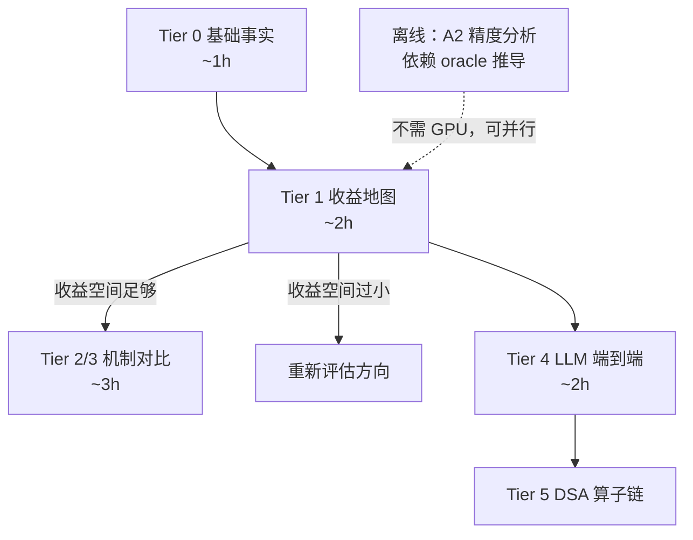

# CTA 级 PDL 性能评估方案（B300 真机 / 快速筛选）

> **目标**：快速判断 [`cta_pdl_design_space.md`](./cta_pdl_design_space.md) 中各维度、各选项**值不值得深入**。周级周期，微基准与上下界包夹为主。
>
> **约束**：
> - 实验机为**租用的单卡 B300 / B200**，与开发机分离 → 所有代码与分析脚本必须**本地完成**，租用后只产出原始数据
> - **`[H+]` 选项不展开**（不做大规模硬件改动），只作为包夹的上界参照
>
> **配套代码**：[`../bench/`](../bench/)

---

## 0. 核心难题与解法

**难题**：设计空间里的绝大多数 CTA 级机制**在 B300 上并不存在**，无法直接实现测量。

**解法**：把"测机制"换成"**包夹机制**"——不去实现它，而是用真机可构造的执行模式把它的收益**夹在一个区间里**。

---

## 1. 通用框架：四点包夹

任何一个设计选项，都测同一组四个点：

| 点 | 含义 | 怎么构造 |
|---|---|---|
| **Floor** | 现状基线 | grid 级 `griddepcontrol.wait`（真实负载上是 **PDL 已开启**的生产配置，见 §6） |
| **Impl** | 该选项的软件实现 | 仅 `[S]` 选项有此点 |
| **Ceiling** | 依赖零成本 | 把依赖完全去掉、两 kernel 无约束并发（**结果是错的，只测时间**；即现有 `pdl_bench` 的 `CONC` 模式） |
| **Ideal** | 有硬件支持时的上限 | 在 Ceiling 基础上**注入该机制的固有开销**（依赖检查延迟、唤醒延迟等，由原语 3 标定） |

### 判读规则

```
Ceiling − Floor  =  该负载的总收益空间     ← 间隙小就直接放弃，不必往下做
Impl    − Floor  =  今天纯软件能拿到的
Ideal   − Impl   =  硬件改动的价值          ← 软件开销中可被硬件消除的部分
```

对无法软件实现的 `[H-]` 选项只有 Floor / Ceiling / Ideal 三点，给出**区间估计**而非精确值——筛选阶段这已经够用。

### 为什么先看 `Ceiling − Floor`

这个差值几乎零成本就能测（两次 kernel launch 配置的差别），却能一票否决一个负载。**任何负载的实验都应该从这一步开始**，避免在没有收益空间的负载上浪费租用时间。

---

## 2. 三个测量原语

### 原语 1：CTA 级时间戳打点

**这是最重要的基础设施，先做。** 每个 CTA 由 thread 0 写一条记录到 global memory：

```
(kernel_id, blockIdx, smid, t_launch, t_dep_satisfied, t_end)
```

#### 关键技术点：必须用 `%globaltimer`，不能用 `clock64()`

| 计时源 | 性质 | 能否跨 SM 比较 |
|---|---|---|
| `clock64()` | **SM 本地**时钟计数器 | **不能** |
| `%globaltimer` | **全局纳秒**计时器 | 能 |

CTA 时间线重建本质是**跨 SM 的事件排序**。用 `clock64()` 会得到看似合理但实际错乱的重叠关系——这是个静默的错误，不会有任何报错。

```cuda
__device__ __forceinline__ unsigned long long globaltimer() {
    unsigned long long t;
    asm volatile("mov.u64 %0, %%globaltimer;" : "=l"(t) :: "memory");
    return t;
}
__device__ __forceinline__ unsigned int smid() {
    unsigned int s;
    asm volatile("mov.u32 %0, %%smid;" : "=r"(s));
    return s;
}
```

#### 开销

每 CTA 32 字节；10K CTA 共 320KB，可忽略。写入只由 thread 0 执行，非原子。

#### 这一个仪器支撑的指标

- **依赖停顿分布**（`t_dep_satisfied − t_launch`，归一化到 CTA 执行时长）→ 对应 BlockMaestro Fig.11
- **CTA 并发度随时间曲线**（区间 `[t_launch, t_end]` 的重叠计数）→ 对应 BlockMaestro Fig.10
- **生产者-消费者的 SM 亲和性**（比对两 kernel 中对应 CTA 的 `smid`）
- **两 grid 的实际重叠比例**

### 原语 2：参数化微基准骨架

在现有 [`pdl_bench.cu`](../../跨stream_PDL调研/bench/pdl_bench/pdl_bench.cu) 基础上扩展，可调：

| 参数 | 取值范围 | 用途 |
|---|---|---|
| 依赖模式 | 1-to-1 / banded(w) / n-to-1 / n-组全连接 / 全连接 / random | E1 的"结构复杂度"变量 |
| 依赖度 | 1 → 1024 | E1 的"依赖度"变量（**必须与上一项独立扫描**） |
| grid 规模 | 64 → 8192 CTA | E1 |
| 每 CTA 计算量 | spin cycles | tail/prologue 比 |
| 每 CTA shared memory | 0 / 8 / 16 / 32 / 64 KB | B2 的 occupancy 代价 |
| 每 CTA 寄存器数 | 通过 `__launch_bounds__` 控制 | B2 |
| 生产者写入量 / 消费者读取量 | 1KB → 64KB / CTA | C1 |

### 原语 3：开销隔离微基准

单独标定各机制自身成本，供 **Ideal 点的注入**使用：

- 各 fence scope（`.cta` / `.gpu` / `.sys`）的延迟
- 原子写完成位图的成本
- 自旋轮询的 L2 访存量，及其对并发 background kernel 的干扰
- `griddepcontrol.wait` 自身延迟
- CLC `try_cancel` 的延迟与仲裁吞吐

---

## 3. Tier 0：基础事实

**第一优先。不测清楚这些，后面所有实验都可能被误读。**

| # | 实验 | 为什么关键 | 产出 |
|---|---|---|---|
| 0.1 | **B300 上同 stream 内实际能重叠几层 kernel？** 构造 K1→K2→K3→K4 链，nsys node 级看真实重叠层数 | 直接决定 B3 维度上哪些选项在 B300 上**可达** | 最大有效窗口深度 |
| 0.2 | **PDL 行为在 sm_103 上是否与 H100 一致** — 尤其"eager 跨流拿不到收益、必须走 CUDA Graph"这条 | 本仓库的结论是 H100 实测，需在 B300 复验 | 复验结论 |
| 0.3 | **等待中 CTA 的 occupancy 代价曲线** — 扫描消费者 kernel 的 shared memory（0/8/16/32/64KB）与寄存器数，测等待时长 vs achieved occupancy vs 端到端时间 | **B2 维度的唯一定价依据**；用于反推"派发前门控"值多少 | 代价曲线 |
| 0.4 | **CLC `try_cancel` 实测特性** — 延迟、并发仲裁吞吐、失败率 | 决定 B4 的软件复现路径与持久化消费者方案是否可行 | 特性表 |
| 0.5 | **各 fence scope 成本标定** | Ideal 点注入所需 | 延迟表 |

预计 GPU 时间：**约 1 小时**。

---

## 4. Tier 1：收益空间地图

**可能推翻整个方向，尽早做。**

### 1.1 依赖度 × grid 规模的收益地图（最高价值的单个实验）

在 B300 真机上复刻 BlockMaestro Figure 12，但修正其实验设计缺陷。

**扫描**：依赖度 1 → 1024（对数步进）× grid 规模 64 → 8192 CTA。
**输出**：`Ceiling − Floor` 的等高线图。

**为什么关键**：BlockMaestro 在 **28 SM 的 Titan X**（896 并发 TB 槽位）上得出两条边界——依赖度 > 32 或 grid > 2048 TB 时收益归零。B300 约 148 SM，并发 CTA 槽位多出约 5 倍，**这两条边界往哪边移是未知且决定性的**：

- 若随槽位数等比放大 → CTA 级方向的适用面显著扩大
- 若反而更紧（现代负载 grid 也更大，单 kernel 更容易填满 GPU）→ 整个方向的适用面需重新评估

**必须修正的设计缺陷**：BlockMaestro 注入依赖的方式是 **n-组全连接**，即依赖度与结构复杂度**同步增长**，两个变量被混在一起。因此其结论无法区分是"边太多"还是"结构太复杂"导致的收益归零。

而真实负载里这两者常常分离——LLM 的 FFN GEMM 链依赖度 ≈ BM（128/256）但是连续区间；DSA 的 indexer→topk 依赖度可达数千同样是连续区间。**照搬阈值会把 LLM 中最常见的两类模式错误排除。**

**因此本实验必须把依赖度与结构复杂度作为两个独立变量分别扫描**：固定结构为"连续区间"扫依赖度，再固定依赖度扫结构（区间 → 分组 → 随机）。

### 1.2 tail / prologue 长度比 × 依赖模式的收益地图

复用现有 `pdl_bench` 的可调参数，加上依赖模式维度。

### 1.3 候选负载的收益空间筛选

对每个候选负载测 `Ceiling − Floor`，输出"值得深入的负载短名单"。

预计 GPU 时间：**约 2 小时**。

---

## 5. Tier 2 / 3：机制对比与特定维度

### Tier 2：核心机制对比（真机可测性最好）

| # | 实验 | 对应维度 | 指标 |
|---|---|---|---|
| 2.1 | **同步协议横评** — 固定 1-to-1 依赖，只换同步实现：软件自旋（固定间隔）/ 自旋 + `__nanosleep` 指数退避 / 单调完成计数器 / `griddepcontrol.wait`（对照） | B1 | 依赖满足→开始执行的延迟；轮询的 L2 读请求数；对并发 background kernel 的干扰幅度 |
| 2.2 | **等待位置的定价** — 真机无法实现派发前门控（`[H+]`），通过 0.3 的 occupancy 曲线反推"若等待不占槽位能省多少" | B2 | 区间估计 |
| 2.3 | **依赖表示编码的成本交叉点** — 区间二元组 / 位掩码 / CSR 邻接表，扫描依赖度 1 → 64 | A3 | 解码延迟、额外访存量、交叉点位置 |

### Tier 3：特定维度

| # | 实验 | 对应维度 | 要点 |
|---|---|---|---|
| 3.1 | **in-order completion 在 diamond 上的代价** — 扩展 `pdl_diamond.cu` 到 CTA 级，对比"强制 K3 等 K2"vs"允许乱序完成" | A1 B3 | **关键是扫描 K2/K3 的时长比（1:1 → 1:10）**，时长差越大，压平非线性拓扑的损失越大 |
| 3.2 | **C1 四版本对比** — producer 写 X 字节/CTA、consumer 读同样数据，扫描 X（1KB→64KB）：融合 + cluster/DSMEM（上界）/ 分离 + L2 persistence / 分离 + 默认 / 分离 + 强制 L2 bypass（下界） | C1 | 指标：DRAM 流量、L2 命中率、端到端时间。**同时测融合版 shared memory 占用翻倍导致的 occupancy 损失**，找 trade-off 平衡点 |
| 3.3 | **调度策略** — TB 调度器不可编程，但**用 CLC + 持久化 kernel 可在软件里完整复现调度策略**：持久 kernel 自己决定优先领取生产者 tile 还是消费者 tile | B4 | 真实对比 producer-priority / consumer-priority / 局部性优先。**这是 B300 上评估 B4 的唯一可行途径，且有硬件原语支撑** |
| 3.4 | **依赖分析的成本与精度** — 大部分是**离线分析，不需要 GPU** | A2 | 用 oracle 依赖图对比各来源推出的图：假边率（决定性能损失）、漏边率（必须为 0）、可分析 kernel 覆盖率；launch 期分析的耗时需实测是否随 gridDim 线性增长 |

预计 GPU 时间：**约 3 小时**。

---

## 6. Tier 4：真实 LLM 端到端（Qwen3.6-27B，单卡）

### 6.1 架构要点（已核实，直接决定实验设计）

| 项 | 值 |
|---|---|
| 参数量 | 27B **dense**（非 MoE） |
| 层数 | 64 |
| 布局 | `16 × (3 × (Gated DeltaNet → FFN) → 1 × (Gated Attention → FFN))` |
| 即 | **48 层 Gated DeltaNet**（线性注意力，递归，**无 KV cache**）+ **16 层标准 GQA**（24Q/4KV，head dim 256） |
| hidden | 5120 |
| FFN intermediate | 17408 |
| 其他 | MTP 支持推测解码；BF16 约 54GB，单卡放得下且 KV cache 压力很小 |

### 6.2 三类值得研究的依赖模式

**1. Gated DeltaNet 的 chunk 间递归（占 48/64 层，主导）**

分块线性注意力是 chunk 内并行、chunk 间顺序递归传状态，典型实现为 intra-chunk kernel + inter-chunk scan kernel。依赖形态是**低依赖度的 1-to-1 长链**，链长 = seq_len / chunk_size。

**这是 CTA 级依赖最有利的场景**——区间表示 O(1)，且链长意味着收益累积。也是选 Qwen3.6-27B 作被测模型的最大理由：它的主体计算模式**就是**本项目研究的那类依赖，不是边角情况。

**2. FFN 的 GEMM 链**（RMSNorm → gate/up GEMM → SwiGLU → down GEMM）

GEMM 输出 tile (m,n) 依赖上游 token 行区间 `[m·BM, (m+1)·BM)`，**依赖度高（≈BM，128/256）但结构极规整**。这是 Tier 1 那个"必须把依赖度与结构复杂度分开测"要求的真实样本。

**3. MTP 推测解码的 draft → verify 依赖**

### 6.3 Floor 基线必须修正为"PDL 已开启"

生产框架**已在用** grid 级 PDL：

| 框架 | 开关 | 备注 |
|---|---|---|
| TensorRT-LLM | `TRTLLM_ENABLE_PDL=1` | 用于 top-k、GEMM、MoE routing |
| vLLM | `TRTLLM_ENABLE_PDL` + `TORCHINDUCTOR_ENABLE_PDL` | **仅在 FULL CUDA graph 下启用**——PDL 的 host 开销在 prefill/piecewise 下反而是负收益 |
| SGLang / Triton | `tl.extra.cuda.gdc_wait()` / `gdc_launch_dependents()` | JIT kernel 与 MoE backend |

已公开的收益量级：vLLM BS1 约 2–3%（个别 10%）、TRT-LLM DeepSeek-R1 on B200 约 3%（168→173 TPS/user）、Triton 简单 kernel 15%、LLM 连续层最高 33%。

**拿 PDL-off 当基线会严重高估 CTA 级的收益空间。**

### 6.4 一个已部署且有明确改进空间的靶点

Triton 的 PDL 实现是**在任何 `tl.load` 之前无条件 `gdc_wait()`**，保守假设前驱 kernel 可能写了任意位置——这正是 BlockMaestro 所说的"全连接回退"，只不过现在是部署在生产框架里的现状。有 CTA 级依赖信息就能大幅缩小等待范围，**改进空间是可以直接量化的**。

### 6.5 核心测量：三档 + 上界

| 档位 | 配置 |
|---|---|
| `PDL_off` | 全部关闭 |
| `PDL_grid`（**Floor**） | 现状生产配置 |
| `Ceiling` | 去掉 `gdc_wait`（结果错误，只测时间），代表依赖零成本 |

**`Ceiling − PDL_grid` = CTA 级还能拿到的上限。这是整个项目最关键的单个数字**；若很小，方向需重新评估。

### 6.6 扫描维度

- **batch size**：1 / 4 / 16 / 64（decode）+ 各长度 prefill
- **序列长度**：4K / 32K / 128K（改变 DeltaNet chunk 链长）

**BS=1 decode 时 grid 最小、GPU 填不满、重叠空间最大** —— vLLM 的"never hurts in the low-batch scenario"印证了这一点。这一扫描把 Tier 1 的微基准结论与真实负载对齐。

### 6.7 CTA 级依赖 ground truth 怎么拿

- 对 **GEMM / norm / SwiGLU** 这类 tile 映射公开可知的 kernel：**直接从 CUTLASS/Triton 的 tile 划分推导，不需插桩**
- 仅对不透明 kernel 用 NVBit 记录每 CTA 的读写地址范围再离线求交（开销 100x+，限少量 kernel）

产出真实依赖二分图，用于计算**区间紧度**与**假边率**。

### 6.8 工具链

- **nsys** 全时间线：kernel 序列、grid 尺寸、时长
- **ncu** 单 kernel 指标：L2/DRAM 流量、achieved occupancy
- 设备侧 `%globaltimer` 打点需要改 kernel，对框架 kernel 不现实 → **只在微基准和自己复刻的 kernel 上使用**

预计 GPU 时间：**约 2 小时**。

---

## 7. Tier 5：DSA 架构模型的收益分析（DeepSeek-V3.2 / GLM-5.x）

### 7.1 单卡确实跑不了整模型

| 模型 | 参数量 | FP8 | FP4 | 单卡 B300 (288GB) |
|---|---|---|---|---|
| DeepSeek-V3.2 | 671B | 671GB | 335GB | 装不下 |
| GLM-5.2 | 744B / 40B-active | 744GB | 372GB | 装不下 |

且 MoE 要求全部 expert 常驻，最少需 2 卡（FP4）到 8 卡（FP8）。

### 7.2 但不必退化为纯纸面分析

**DSA 的注意力层参数量很小，单层与算子链可以在单卡上用真实 shape 实测。**

GLM-5.2 关键配置：hidden 6144、`kv_lora_rank` 512、`q_lora_rank` 2048、`index_head_dim` 128、`index_n_heads` 32、`index_topk` 2048、78 层（前 3 层 dense FFN，其余 MoE，256 expert 选 8 + 1 shared）。

开源实现可用：DeepSeek 官方 inference 代码、TileLang 的 DSA kernel、FlashMLA。

**三层处理**：架构级依赖图推导（纯离线）→ 单层/算子链单卡实测 → 整模型端到端仅作纸面外推。

### 7.3 DSA 的依赖形态分析（本节核心产出）

kernel 链为 `lightning indexer → top-k selection → sparse MLA attention`。

#### (1) indexer → topk：依赖度极高但结构极规整

topk 处理 query 块 *j* 时需要该 *j* 在 key 方向的**全部**得分，因此依赖 indexer 中该 query 块的**整行 CTA**。

- 依赖度 = L / key_block，1M 上下文下可达**数千**
- 但结构是二维网格中的**一段连续区间**，**区间表示仅 O(1)**

这是"高依赖度 ≠ 复杂结构"的典型样本，可直接用来检验 §4.1 提出的实验设计要求。BlockMaestro"依赖度 > 32 收益归零"的结论会**错误地排除它**。

#### (2) topk → sparse attention：看似间接访存，实则 RAW 依赖链是规整的

sparse attention 读两类数据：

| 数据 | 来源 | 是否构成 kernel 间 RAW 依赖 |
|---|---|---|
| 索引数组 `idx` | 本步 topk 产生 | **是**，且按 query 块是 **1-to-1** |
| 被选中的 KV 条目 | **更早的 decode step 或 prefill 写入** | **否** |

**间接寻址决定的是"读历史数据的哪个位置"，并不构成对紧邻前驱的不可预测依赖。**

**两个后果**：

1. **DSA 对 CTA 级依赖其实是友好的**，不是想象中的困难场景
2. **BlockMaestro 的 Algorithm 1 会在这里错误地保守退化** —— 它一见到地址来源于 global load 就 bail out，无法区分"间接读的是本步产出"与"间接读的是历史数据"。**按数据的产生时间而非仅按地址来源判定**，是一个具体且可实现的算法改进点（已写入设计空间报告 A2）

#### (3) GLM-5.2 的 IndexShare 把依赖跨度拉长

每 4 层共享一个 indexer、top-k 索引在 4 层内复用，依赖链变成：

```
indexer(L1) → attn(L1) → attn(L2) → attn(L3) → attn(L4)
```

索引数组由**数个 kernel 之前**的算子产生，恰好满足 [`prologue_inspector_cta_pdl.md`](../design_brainstorm/prologue_inspector_cta_pdl.md) §9 的硬约束（"结构数组不能由紧邻的生产者 kernel 写"）。同时也是 A1 维度"跨度 > 1"的真实样本。

#### (4) MoE 的 dispatch/combine 才是真正的困难场景

```
router → top-8 → permute/gather → grouped GEMM → unpermute/scatter
```

permute 的索引由**紧邻前驱 router** 产生，属于"结构动态"，inspector 救不了；grouped GEMM 每个 CTA 的依赖度取决于该 expert 分到多少 token，运行时才确定。TRT-LLM 已在 MoE routing 上用 PDL，可作对照基线。

### 7.4 单卡可实测的部分

- `indexer → topk → sparse MLA` 三算子链的三档对比，用真实 shape
- 扫描上下文 4K / 32K / 128K / 1M（indexer 的 O(L²) 特性使长上下文下该链占比急剧上升，收益空间随之变化）
- 单层 MLA + DSA 完整 forward
- MoE 层用**缩减 expert 数**（如 32 而非 256）复现 dispatch/combine 的依赖形态

### 7.5 只能纸面外推的部分

- 整模型端到端 TPS/user
- EP / TP 并行下的跨卡依赖（超出本项目单卡范围）

---

## 8. 各维度可测性判定

| 类别 | 维度 | 说明 |
|---|---|---|
| **真机可直接测** | A1、A3、B1、B3、C2、D1、E1 | 软件即可构造 |
| **可用 CLC 持久化 kernel 在软件中复现后测** | B4、A4 的分布式变体 | 持久 kernel 自己做调度决策 |
| **只能包夹估值** | B2（派发前门控是 `[H+]`）、A4 的集中式变体 | 用 occupancy 曲线反推 |
| **只能测上界** | C1 | 跨 kernel shared memory 所有权转移无法实现，用 fused+DSMEM 作上界 |
| **主要靠离线分析** | A2 | oracle 依赖图对比，不需 GPU |
| **无对口实验** | D2 | 依赖描述的 soundness 验证需要先有实现 |

---

## 9. 租用 GPU 的成本控制

实验机与开发机分离，因此：

**本地先完成**：全部代码、离线分析脚本、依赖模式推导、可无人值守执行的批处理脚本。

**租用后只负责产出原始数据**，分析全部回本地做。

| 阶段 | 预算 |
|---|---|
| Tier 0 基础事实 | ~1h |
| Tier 1 收益地图 | ~2h |
| Tier 4 LLM profiling | ~2h |
| Tier 2/3 机制对比 | ~3h |
| **合计** | **~8 GPU-hours** |

**所有脚本必须能一次性跑完并把原始数据落盘**（含失败重试与断点续跑），避免交互式调试消耗租用时间。见 [`../bench/run_all.sh`](../bench/run_all.sh)。

---

## 10. 执行顺序建议



**Tier 1 的 1.1 是决策点**：若 `Ceiling − Floor` 在 B300 的参数区间内普遍很小，应停下来重新评估整个方向，而不是继续做 Tier 2/3。
